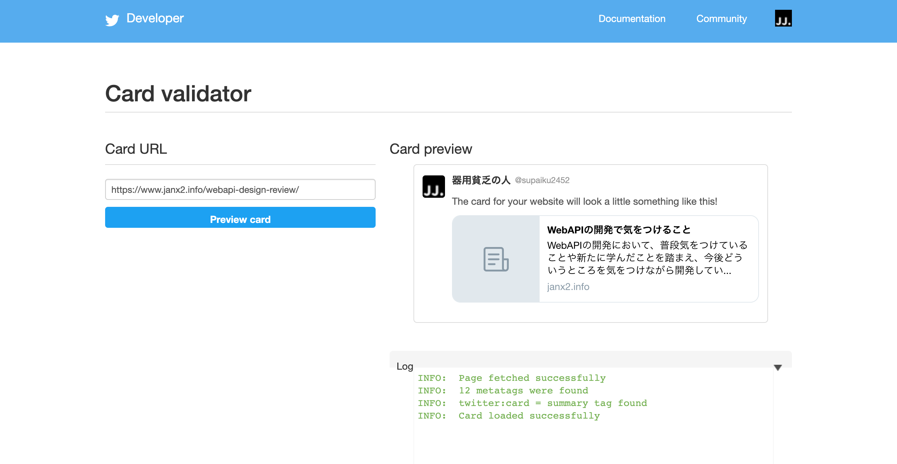

# twitter cards

[ツイートをカードで最適化する](https://developer.twitter.com/ja/docs/tweets/optimize-with-cards/guides/getting-started) を参考に。どうやら、メディア毎で宣言が変わりそう(facebook/twitterなど)

## twitter cardsとは

ツイッター上でURLを共有したときに表示されるカードを制御すること。基本仕様などは上記リンクから確認。

twitterのカードは[Card validator](https://cards-dev.twitter.com/validator) から確認出来る


## TwitterカードとOpen Graph

原則、OGPと同じ規則に基づいている。ツイッターカードのプロセッサーの解釈の順番は、`twitter:xxx` -> `og:xxx`の順番になる

OGPとツイッターでmetaに指定する属性が異なる

**twitterの場合**は、`name`と`content`を利用する
```html
<meta name="twitter:card" content="summary" />
<meta name="twitter:site" content="@nytimesbits" />
<meta name="twitter:creator" content="@nickbilton" />
```

**OGPの場合**は、`property`と`content`を利用する
```html
<meta property="og:url" content="http://bits.blogs.nytimes.com/2011/12/08/a-twitter-for-my-sister/" />
<meta property="og:title" content="A Twitter for My Sister" />
<meta property="og:description" content="In the early days, Twitter grew so quickly that it was almost impossible to add new features because engineers spent their time trying to keep the rocket ship from stalling." />
```
