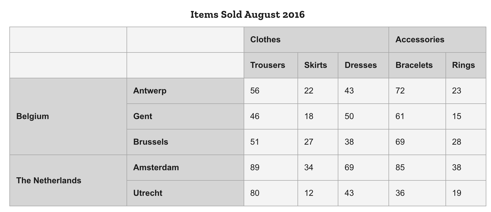

# 高度な機能とアクセシビリティ

[HTML 表の高度な機能とアクセシビリティ](https://developer.mozilla.org/ja/docs/Learn/HTML/Tables/Advanced)から学ぶ

## 基本

### キャプション

キャプションをつける場合は、table要素にネストした状態で入れる。これがあることで、スクリーンリーダーでキャプションを読み取り、よりテーブルの情報を理解することに役立つ。

`summary`属性を使っても良いが、html5で推奨されていないためcaptionを使う方が良い

```html
<table>
    <caption>ここがキャプション</caption>
</table>
```

### <thead>、<tfoot>、<tbody> を用いて構造を追加する

テーブル構成が複雑になったら、`<thead>`、`<tfoot>`、`<tbody>`を使用すると良い。これらはアクセシビリティやデフォルトCSSは当たらないが、CSSのマークアップという意味で役に立つ

### ネストした表

実装は可能だが、スクリーンリーダーで読みづらくなるため使用しない方がよい

### scope 属性

視覚的に問題ない人はGentとRingsのひも付けは問題なく、**15**と関連付けられる。ただし、スクリーンリーダーを必要とする人はこの紐付けが困難である。そこで`scope`属性を使い、アクセスしやすいようにする



`<th>`要素にscope属性を追加する

```html
<thead>
  <tr>
    <th scope="col">Purchase</th>
    <th scope="col">Location</th>
    <th scope="col">Date</th>
    <th scope="col">Evaluation</th>
    <th scope="col">Cost (€)</th>
  </tr>
</thead>

<tr>
    <th scope="row">Haircut</th>
    <td>Hairdresser</td>
    <td>12/09</td>
    <td>Great idea</td>
    <td>30</td>
</tr>
```

上記のように行、列の情報を追加するとスクリーンリーダーは列全体、行全体を読み上げることが出来る
